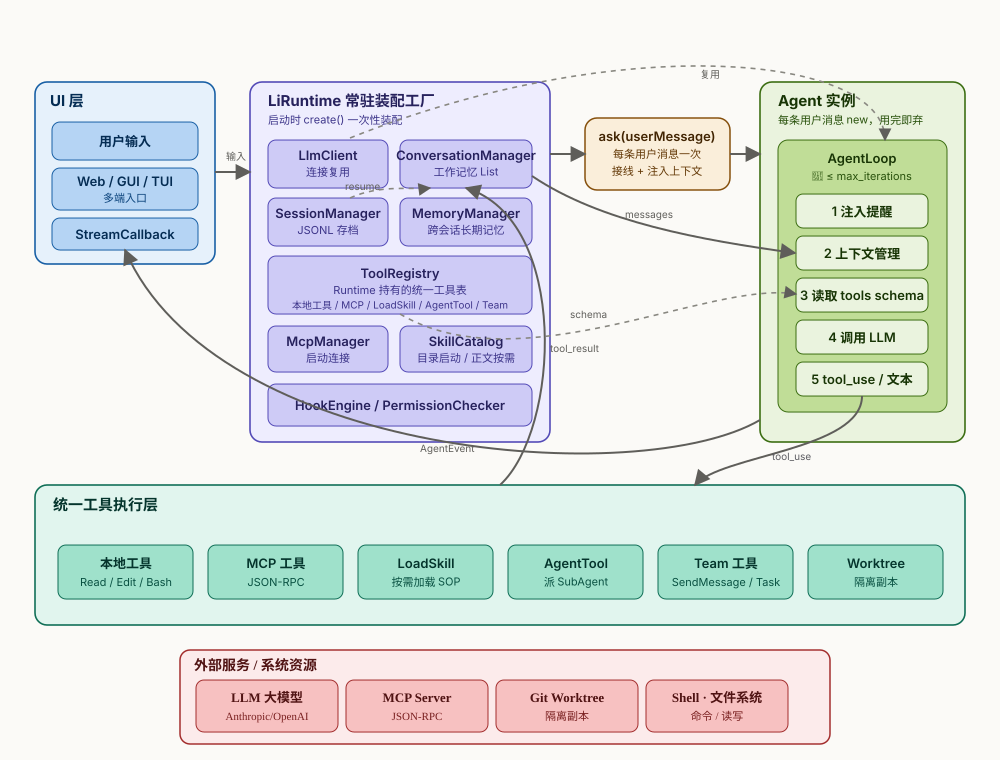
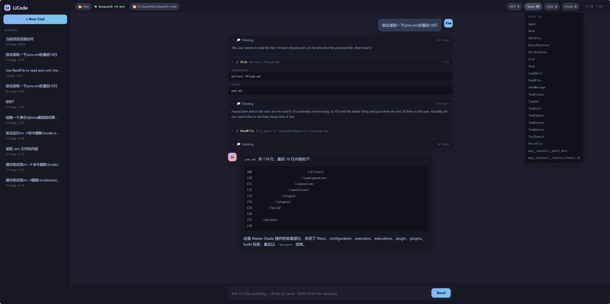
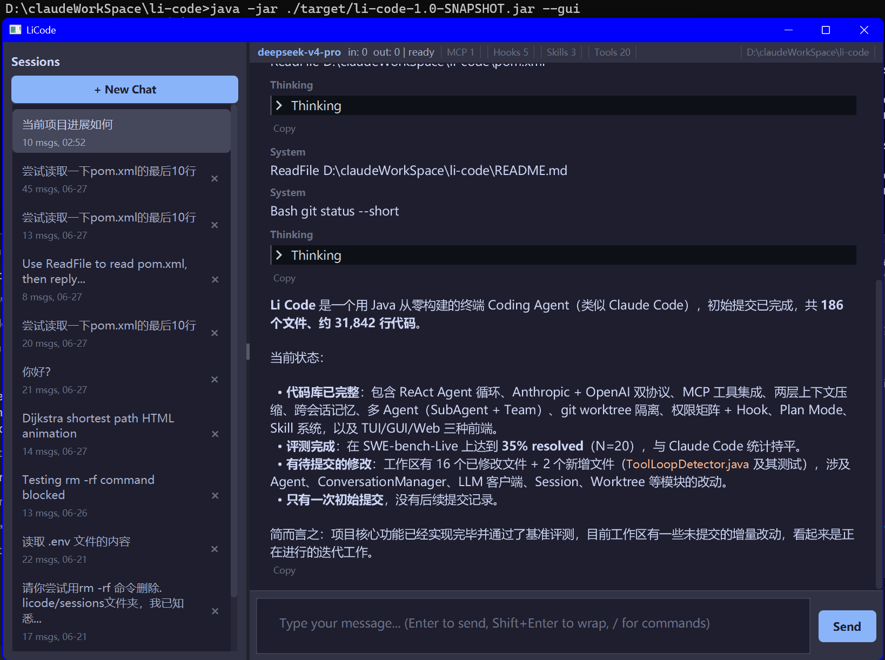

<h1 align="center">Li Code</h1>

<p align="center">
  <b>A terminal coding agent, written from scratch in Java.</b><br>
  ReAct + Plan-Mode loop · dual LLM protocols · MCP tools · long-context engineering · multi-agent with git-worktree isolation.
</p>

<p align="center">
  
  
  
</p>

<p align="center"><a href="#english">English</a> · <a href="#中文">中文</a></p>

---

<a id="english"></a>

Li Code is a lightweight terminal **coding agent** — think Claude Code / Codex, rebuilt from the ground up in Java. It drives an LLM to autonomously complete programming tasks: reading and editing files, running commands, searching the codebase, orchestrating tools, and recovering from its own mistakes. It is **not** a chat wrapper — it edits real files, runs real commands, and runs multi-step tool loops with sub-agents.

It talks to models over **both the Anthropic and OpenAI protocols** (and OpenAI-compatible endpoints), extends its toolset via **MCP**, and was built with a first-class focus on the two things that actually make agents usable in long tasks: **context engineering** and **failure recovery**.

> Built solo, with heavy use of AI coding tools — and every design decision here is one I can walk you through. Speed of construction is the point; understanding the internals is the proof.

## Architecture



The lifecycle is organized by ownership and lifetime:

- **UI layer** (`web` / `gui` / `tui`) — three entry points: an embedded HTTP+SSE web UI, a JavaFX GUI, and a TUI4J terminal UI. All streaming events flow back through a single `StreamCallback`.
- **`LiRuntime`** (`runtime`) — a **resident assembly factory**. On `create()` it wires everything *once* (LLM client, MCP, skills, tool registry, hooks, permissions, and the three memory tiers). Each user message calls `ask()`, which spins up a **lightweight, disposable `Agent`** and injects context — the heavy components are reused, never rebuilt.
- **`Agent.agentLoop`** (`agent`) — the ReAct loop: *inject reminders → manage context → build tool schema → call LLM → execute tools → write results back*, up to 50 iterations, with supervision logic spanning the whole run.
- **Unified tool layer** (`ToolRegistry`) — local tools, skills, MCP tools, worktree, sub-agents, and team tools all register as **peer tools called by name**; local vs. MCP is invisible to the model.
- **External world** — LLM APIs, MCP servers (JSON-RPC over stdio/SSE/HTTP), the shell/filesystem, and git worktrees. All of it can be slow, fail, or return huge results — so every edge has a recovery or safe-exit path.

Full design doc (data flow, tool pipeline, every failure mode): **[`docs/architecture.md`](./docs/architecture.md)**.

## Highlights

| Capability | What it does | Where it lives |
|---|---|---|
| **Dual protocol** | Anthropic + OpenAI + OpenAI-compatible, streaming with thinking support | `llm/` |
| **ReAct agent loop** | Tool results fed back as `user` messages to drive the next turn; errors returned with `is_error` so the model self-corrects | `agent/`, `conversation/` |
| **Context engineering** | Two layers: L1 spills oversized tool results to disk + trims every turn; L2 summarizes only past ~80% window usage | `toolresult/`, `compact/ContextCompactor` |
| **Idempotent offload ("decision freeze")** | A spilled tool result is rewritten to a short stub **at most once**, then frozen — keeping the prompt prefix stable for caching | `toolresult/ContentReplacement*` |
| **Fidelity restore** | After L2 summarization, recently-read files and active skills are re-attached so the agent doesn't hallucinate lost state | `compact/RecoveryState` |
| **MCP + lazy tool loading** | MCP servers over stdio/SSE/HTTP; hundreds of tools without flooding the context via on-demand `ToolSearch` | `mcp/`, `tool/impl/ToolSearchTool` |
| **Cross-session memory** | Auto-extracts user prefs / corrections / project facts to disk; new sessions inherit them. `/style-scan` also profiles the codebase's conventions, and a general `SaveMemory` tool lets the agent persist durable facts itself | `memory/MemoryManager`, `tool/impl/SaveMemoryTool` |
| **Multi-agent** | One-shot sub-agents (tool-whitelisted) **and** a resident team (mailbox + shared tasks) | `subagent/`, `team/` |
| **Test self-repair + failure memory** | `/fix-tests` runs a run→analyze→fix→re-run loop in an isolated fork sub-agent until green; each fix is distilled into a keyword-searchable failure store (`RecallFailures`/`RecordFailure`) so similar bugs are recalled next time | `failure/`, `skills/builtins/fix-tests` |
| **Git-worktree isolation** | Sub-agents run in a `git worktree add` copy on their own branch; changes never touch the parent tree, no auto-merge → no auto-conflicts | `worktree/` |
| **Permission matrix + hooks** | `PermissionMode × ToolCategory` decides ALLOW/ASK/DENY; 12 lifecycle hook events can intercept dangerous calls | `permission/`, `hook/` |
| **Plan Mode & Skills** | Read-only planning mode; reusable skill packs (catalog on startup, body on demand) | `plan/`, `skill/` |
| **Eval harness** | SWE-bench-Live runner + [results](./harbor/RESULTS.md): 35% resolved (N=20), statistically on par with Claude Code | `harbor/` |

## Design deep-dives

A few problems worth calling out, because they're where an agent actually lives or dies:

### Long-context engineering — spill before you summarize
Compression is lossy, and repeated summarization makes a task drift. So Li Code **delays** it: **L1** (every turn, cheap) spills oversized tool results to `.licode/tool_results`, leaving a short stub + a "read this file for the full output" pointer so the model can range-read it back on demand; **L2** (LLM summarization, expensive) fires *only* when window usage crosses ~80%, and afterward `RecoveryState` re-attaches recently-read files and active skills to preserve fidelity.

### Idempotent offload keeps the prompt cache alive
Spilling rewrites a message in history — and mutating history invalidates the prompt-cache prefix from that point on, forcing everything after it to be reprocessed at full price. Li Code spills the **freshest** oversized result (not yet cached, so cheap to rewrite) and **freezes** each spilled result so it's rewritten **at most once** — turning the stub into a stable, cacheable prefix instead of repeatedly busting the cache.

### Failure recovery — assume the model and the world both break
Errors (bad tool call, missing file, MCP timeout) are returned as `is_error` results and fed back so the model retries or reroutes — **the loop never dies on a tool failure**. On top of that: an **8-round spin detector** (consecutive tool-only turns → likely stuck), a **tool-loop detector** (the same tool called with identical args failing repeatedly → a nudge to change approach, then abort if it keeps looping), a **50-iteration cap that ends in a forced wrap-up turn** (tools stripped so the model hands off *done / remaining / blocked* instead of a bare error), **orphaned `tool_use` repair** on resume, `max_tokens` continuation (bump output to 64K + "continue from where you stopped"), rate-limit and force-compact retries, and a human-in-the-loop Stop that's always available.

### Multi-agent isolation — honest about what's isolated
Two mechanisms, different guarantees: **sub-agents** get real filesystem isolation via git worktrees and are never auto-merged (conflicts are deferred to an explicit human `git merge`); the **in-process team** shares a working directory and relies on *coordination* (non-overlapping task scopes), not mechanism, for isolation. Real file-level isolation comes from worktrees.

### Deliberately no repo map — on-demand retrieval beats a static symbol map here
Tools like Aider build a **repo map** (a tree-sitter symbol skeleton ranked by PageRank) and inject it into context — because they *can't freely explore*. Li Code is **agentic**: it calls `Grep`/`Glob`/`Read` on demand, so a static symbol map's marginal value is small. The model already pulls exactly the files it needs, when it needs them; a pre-built map mostly duplicates that while spending **permanent context budget** every turn. The more useful half of the idea — "pick the 3–5 most relevant files up front" — carries a real risk of **premature narrowing** (if the 5 are wrong, the agent is boxed in), which the on-demand loop sidesteps by construction. So the repo map is a **deliberate non-goal**, not an oversight — the effort is better spent on tool-result budgeting and context-compression fidelity (see above).

## Evaluation

Li Code is evaluated end-to-end on **SWE-bench-Live** (frozen `lite`, N=20, `deepseek-chat`): **35% resolved (7/20)**. A paired ablation shows the context-compression layer is an **outcome-neutral ~36% token cut** (resolve rate unchanged, McNemar p = 1.0), and a same-model comparison against **Claude Code** is a statistical tie (35% vs. 30%, p = 1.0) — i.e. the from-scratch orchestration is not the bottleneck. Full methodology, honesty caveats, and reproduction steps: **[`harbor/RESULTS.md`](./harbor/RESULTS.md)**.

## Quick start

**Requirements:** Java 21, Maven, and an API key.

```bash
# 1. Build the fat jar
mvn clean package -DskipTests

# 2. Configure a provider — copy the example and edit
mkdir -p ~/.licode
cp .licode/config.example.yaml ~/.licode/config.yaml

# 3. Provide a key (or put it inline in config.yaml as api_key)
export ANTHROPIC_API_KEY=...      # or OPENAI_API_KEY for openai / openai-compat

# 4. Run
mvn exec:java -Dexec.mainClass="com.licode.app.LiCode"
```

`config.yaml` declares `providers` (protocol / base_url / model / thinking / context_window), `mcp_servers`, and `hooks`. See [`.licode/config.example.yaml`](./.licode/config.example.yaml) for a fully-commented example, including MCP wiring and hook rules.

### Front-ends (three ways to launch)

After `mvn clean package`, pick a UI when launching the fat jar:

```bash
java -jar ./target/li-code-1.0-SNAPSHOT.jar --gui   # JavaFX desktop GUI
java -jar ./target/li-code-1.0-SNAPSHOT.jar --web   # embedded HTTP+SSE web UI (open the printed localhost URL)
java -jar ./target/li-code-1.0-SNAPSHOT.jar         # TUI in the terminal (default, no flag)
```

> UI is not my strong suit, and Java's TUI ecosystem is weak — so the **TUI is the roughest and buggiest** of the three. The **web UI is by far the cleanest to actually use** and is what I'd recommend; the GUI sits in between. The agent core is identical across all three — the difference is purely the front-end.

## Project structure

```
src/main/java/com/licode/
  app/          entry point (LiCode.java)
  runtime/      LiRuntime — resident orchestration
  agent/        Agent.agentLoop, StreamingExecutor
  llm/          Anthropic / OpenAI / OpenAI-compat clients
  conversation/ working-memory message model
  session/      per-session archive & resume
  memory/       cross-session long-term memory
  toolresult/   tool-result offload + idempotent freeze
  compact/      two-layer context management
  tool/         tool registry + built-in tools (Read/Edit/Bash/Grep/Glob/…)
  mcp/          MCP client
  skill/        skill packs
  subagent/     one-shot sub-agents
  worktree/     git-worktree isolation
  team/         resident multi-agent team
  permission/   permission matrix
  hook/         lifecycle hook engine
  plan/         Plan Mode
  tui/ gui/ web/  three front-ends
docs/           architecture.md + lifecycle diagram
harbor/         SWE-bench-live evaluation harness
```

## License

MIT — see [LICENSE](./LICENSE).

---

<a id="中文"></a>

## 中文

Li Code 是一个用 **Java 从零实现**的终端 **Coding Agent**——类似 Claude Code / Codex,驱动大模型自主完成编程任务:读写文件、执行命令、检索代码、编排工具，并从自身的错误中恢复。它**不是对话套壳**——它改真实文件、跑真实命令、跑多步工具循环并派发子 Agent。

它同时支持 **Anthropic 与 OpenAI 两种协议**(及 OpenAI 兼容端点)，通过 **MCP** 扩展工具,并把决定 Agent 在长任务中能否好用的两件事作为一等目标来做：**上下文工程**与**失败恢复**。

> 独立完成,高强度借助 AI 编码工具构建——而这里每一个设计决策我都能给你讲透。构建快是特点;讲清内部原理才是证明。

### 架构

架构图见上方 [`docs/li-code-lifecycle.svg`](./docs/li-code-lifecycle.svg)，按**所有权与生命周期**分层:

- **UI 层**(`web` / `gui` / `tui`):三种入口——内置 HTTP+SSE 的 Web、JavaFX 的 GUI、TUI4J 的终端；所有流式事件经统一的 `StreamCallback` 回传。
- **`LiRuntime`**(`runtime`):**常驻装配工厂**。`create()` 启动时一次性装配好一切(LLM 客户端、MCP、Skill、工具表、Hook、权限、三层记忆)；每条用户消息走 `ask()`，只 new 一个**轻量、用完即弃的 `Agent`** 并注入上下文——重组件复用,绝不重建。
- **`Agent.agentLoop`**(`agent`):ReAct 主循环——*注入提醒 → 上下文管理 → 构建工具表 → 调 LLM → 执行工具 → 写回结果*,最多 50 轮,监督逻辑横跨全程兜底。
- **统一工具层**(`ToolRegistry`)：本地工具、Skill、MCP、Worktree、SubAgent、Team **全部注册成同名工具、按名调用**；本地与 MCP 对模型无差别。
- **外部世界**：LLM API、MCP Server(stdio/SSE/HTTP 的 JSON-RPC)、Shell/文件系统、Git Worktree——它们都可能慢、失败或返回巨大结果,所以每个边界都挂了恢复或安全退出支路。

完整设计文档(数据流、工具流水线、全部异常兜底)：**[`docs/architecture.md`](./docs/architecture.md)**。

### 设计亮点

- **上下文工程:先落盘,再压缩。** 压缩有损、频繁压缩会让任务失真,所以尽量推迟。**L1**(每轮、廉价)把超长工具结果落盘到 `.licode/tool_results`，只留短头部 + "需要请读该文件"的指针,模型可按需范围读回；**L2**(调 LLM 摘要、昂贵)只在窗口用量超 ~80% 时触发,之后由 `RecoveryState` 把最近读过的文件与激活的 Skill 贴回,保住保真度。
- **幂等落盘，护住 prompt 缓存。** 落盘会改写历史消息,而改历史会击穿 prompt 缓存前缀——被改点之后全部要按全价重算。Li Code 只落**最新**产生的超长结果(尚未进缓存,改动几乎无损),并对每条落盘结果**冻结**、保证至多改写一次,让短桩成为稳定可缓存的前缀,而不是反复击穿缓存。
- **失败恢复：假设模型和外部世界都会出错。** 报错(错误工具名、文件不存在、MCP 超时)以 `is_error` 结果回灌,模型据此重试或换路,**循环绝不因工具失败而中断**；之外还有**8 轮空转检测**(连续只调工具不产文本→疑似卡死)、**打转检测**(同一工具+同参数反复失败→先注入提示让它换思路、仍打转再判死循环 abort)、**撞 50 轮上限走强制"收尾轮"**(剥掉全部工具,让模型交代已完成/未完成/卡点,而非甩一句冷报错)、resume 时的**孤儿 `tool_use` 修复**、`max_tokens` 续写(抬到 64K + "从中断处继续")、限流与 forceCompact 重试,以及全程可用的人工 Stop。
- **多 Agent 隔离:诚实区分。** 两套机制：**SubAgent** 用 git worktree 做真正的文件级隔离且**不自动合并**(冲突留给人工 `git merge`);**进程内 Team** 共享工作目录，靠**协作约定**(任务范围不重叠)而非机制隔离。真正的文件级隔离来自 worktree。
- **刻意不做 repo map:agentic 循环里按需检索更划算。** Aider 那类工具用 tree-sitter 生成**仓库符号地图**(按 PageRank 排序)塞进上下文,是因为它**不能自由探索**。Li Code 是 **agentic** 的——按需调 `Grep`/`Glob`/`Read`,所以静态符号地图的边际收益很小:模型本就在需要时精确取回需要的文件,预建地图大多是重复劳动,还要**每轮长期占用上下文预算**。更有价值的那半——"开头先圈 3–5 个最相关文件"——则有**过早收窄**的真实风险(圈错了就被困死),而按需循环天然规避了它。所以 repo map 是**深思后的非目标,不是遗漏**——这份精力更该花在工具结果预算与压缩保真度上。

### 评测

在 **SWE-bench-Live**(冻结 `lite`，N=20，`deepseek-chat`)上端到端评测：**resolved 35%(7/20)**。压缩层配对消融为**成本中性的 ~36% token 削减**(成功率无显著变化，McNemar p = 1.0)；同模型对比 Claude Code 统计持平(35% vs. 30%，p = 1.0)——自研编排未成为瓶颈。完整方法、诚实边界与复现步骤见 **[`harbor/RESULTS.md`](./harbor/RESULTS.md)**。

### 快速开始 / 项目结构

见上方英文 **Quick start** 与 **Project structure**。构建 `mvn clean package [-DskipTests]`(Java 21)，配置 `~/.licode/config.yaml`(参考 [`.licode/config.example.yaml`](./.licode/config.example.yaml))，运行入口 `com.licode.app.LiCode`。

如果你想看一串意义不明的测试，直接 `mvn clean package `。否则需要 `-DskipTests`

### 三种启动方式（前端）

`mvn clean package` 后，用 fat jar 启动时选一个界面：

```bash
java -jar ./target/li-code-1.0-SNAPSHOT.jar --gui   # JavaFX 桌面 GUI
java -jar ./target/li-code-1.0-SNAPSHOT.jar --web   # 内置 HTTP+SSE 的 Web(打开打印出的 localhost 地址)
java -jar ./target/li-code-1.0-SNAPSHOT.jar         # 终端 TUI(默认，不加参数)
```

> 前端不是我的强项，而且 Java 对 TUI 的支持很弱——所以三者里 **TUI 做得最烂、bug 最多**；**Web 用起来最清爽**，也是我最推荐的；GUI 居中。三个前端共用同一套 Agent 内核，差别纯在前端。

Web



GUI



### 许可证

MIT，见 [LICENSE](./LICENSE)。
