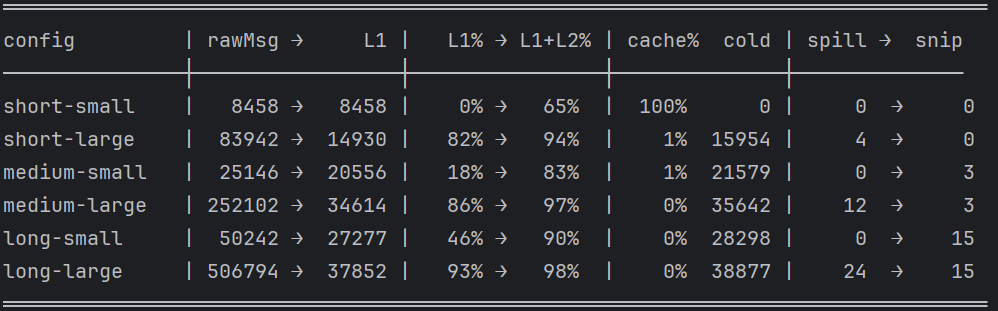

# LiCode 架构总览

本文记录 LiCode 的**分层架构**、**数据流**、**工具执行流程**与**异常兜底**,作为理解整个技术闭环的索引。LiCode 是**单进程 Java 应用**(非客户端-服务端分离):UI 与 Agent 之间是进程内 `StreamCallback` 回传,SSE 仅用于 Web 这一端。

> 代码锚点:`Agent.agentLoop`(主循环)、`StreamingExecutor`(工具执行)、`ContextCompactor`(上下文压缩)、`PermissionMode`(权限矩阵)、`HookEngine`(切面)、`AgentTool`(子 Agent)、`team/*`(多 Agent)、`LiRuntime`(装配/编排)。

---

## 一、分层架构

### 各层职责速览
- **UI 层**(`com.licode.web` / `gui` / `tui`):三种入口 —— 内置 HTTP+SSE 的 Web、JavaFX 的 GUI、TUI4J 的终端 UI;所有流式事件经 `StreamCallback` 回传渲染。
- **编排层 `LiRuntime`**(`com.licode.runtime`):常驻装配工厂。**记忆三层**——`ConversationManager`(工作记忆/内存) · `SessionManager`(本会话存档/resume) · `MemoryManager`(跨会话长期记忆;除自动抽取外,`/style-scan` 可扫代码库生成项目风格 profile 写入,Agent 也能用通用 `SaveMemory` 工具主动落盘)。**装配在 `create()` 启动时一次性完成**(MCP/Skill/Tools/Hook/权限/各 Manager/LlmClient);`ask()` 每轮只是 new 一个轻量 `Agent`、把已装配组件接线上去、注入上下文,再起循环。
- **Agent 核心循环**(`com.licode.agent`):`agentLoop` 每轮"注入提醒 → 上下文管理 → 构建工具表 → 调 LLM → 执行工具 → 写回",最多 50 轮;`AgentLoopExecutor` 式的监督逻辑横跨全程做兜底。
- **统一工具层 `ToolRegistry`**:本地工具、Skill、MCP、Worktree、SubAgent、Team **全部注册成同名工具**,模型按名字调用,本地与 MCP 无差别(`LiRuntime` 连接 MCP 后 `toolRegistry.register(tool)`)。
- **外部服务**:LLM 大模型(Anthropic / OpenAI / 兼容)、MCP Server(stdio·SSE·HTTP 的 JSON-RPC)、Git Worktree、Shell 与文件系统。

---

## 二、核心数据流(ReAct 循环)

一次完整请求的数据流向:

1. **入口与回传通道**:用户在某个 UI 输入消息 → `LiRuntime.ask(text, callback)`。Runtime 起一个虚拟线程跑 `Agent.run()`,Agent 把过程事件投递到一个 `BlockingQueue<AgentEvent>`,消费侧把每个事件经 `StreamCallback` 实时回传 UI(Web 端再转成 SSE 帧)。**UI 输入框全程不锁**,可随时输入或点 Stop。
2. **循环每一轮(调 LLM 前)**:
   - **① 注入提醒** —— plan 模式提示、后台任务通知作为 system-reminder 注入。
   - **② 上下文管理** —— `ContextCompactor.manage`:L1(把超大工具结果 spill 到 `.licode/tool_results`、裁剪过旧结果)每轮恒做;L2(调一次 LLM 生成摘要)只在用量超 ~80% 阈值时触发,摘要后用 `RecoveryState` 把最近读过的文件 / 激活的 Skill 重新贴回。
   - **③ 构建工具表** —— 从 `ToolRegistry` 取 schema(可被 SubAgent 的工具白名单过滤)。
   - **④ 调 LLM(流式)** —— 产出思考 / 文本 / 工具调用,逐 token 回传。
3. **分叉:有没有工具调用**
   - **没有** → 把最终回复写回对话 → `LoopComplete` → 落盘会话 → 本轮结束。
   - **有** → 进 `StreamingExecutor`(详见第三节):权限 → Pre-Hook → 执行(**本地工具进程内 / MCP 工具 JSON-RPC / 子 Agent**) → 记忆快照 → Post-Hook → **⑥ 写回结果 → 回到 ①**。
4. **收口**:无论正常完成、报错还是被中断,都会 `saveRecentMessages` 落盘到 `.licode/sessions`,下次可 resume。

---

## 三、工具执行流程(`StreamingExecutor`)

模型产出工具调用后,每个工具依次过这几道关:

1. **并发分流**:按 `ToolCategory` 分组 —— `READ`(只读)**虚拟线程并行**;`WRITE` / `COMMAND` **串行**,避免写冲突。
2. **权限隔离(各级)**:`PermissionChecker` 用 `PermissionMode × ToolCategory` 判决:

   | 模式 | READ | WRITE | COMMAND |
   |---|---|---|---|
   | `DEFAULT` | ALLOW | ASK | ASK |
   | `ACCEPT_EDITS` | ALLOW | ALLOW | ASK |
   | `PLAN` | ALLOW | 写类被 plan 拦死 | ASK |
   | `BYPASS` | ALLOW | ALLOW | ALLOW |

   三态 `ALLOW / ASK / DENY`;ASK 经 `PermissionRequestEvent` 弹给 UI,用户选 `ALLOW / ALLOW_ALWAYS / DENY`,"永远允许"写进规则下次自动放行。
3. **Pre-Hook 拦截**:`runPreToolHooks` 触发 `pre_tool_use`,Hook 可直接拒绝本次调用(`!` 前缀可 bypass)。
4. **执行**:`tool.execute(args)` —— **本地工具进程内跑;MCP 工具内部发 JSON-RPC 到外部 Server;`AgentTool` 起一个子 Agent**。执行前把父事件队列接给子 Agent,使其边跑边汇报进度(防父流超时)。
5. **记忆快照**:`ReadFile` 成功后把内容存进 `RecoveryState`,供 L2 压缩后恢复。
6. **Post-Hook**:触发 `post_tool_use`(异常时另触发 `error` Hook);结果包成 `ToolResultBlock` 写回对话。

> **Hook 12 事件全集**:`startup / shutdown / session_start / session_end / turn_start / turn_end / pre_send / post_receive / pre_tool_use / post_tool_use / error / compact`。

---

## 四、异常场景与兜底

LiCode 的设计前提是 **"模型和外部世界都会出错"**,所以每个不确定点都有就地恢复或安全退出。按来源分类:

### 1. 检索 / 读取"查不到"
- **搜索无命中**(Grep / Glob 没匹配):工具正常返回空结果,不是异常;模型据此判断"此处没有",自行换关键词或换路径。
- **文件不存在 / 读失败**(ReadFile):工具返回错误文本(`isError=true`)写回对话,模型看到后会先列目录或换路径,而不是凭空假设内容。
- **调用了不存在的工具名**:`StreamingExecutor` 直接回 `"Unknown tool: <name>"` 错误结果,模型重新选择正确工具。
- **L2 压缩后"记不全"**:`RecoveryState` 会把最近读过的文件、激活的 Skill 原样贴回摘要后面;真要精确内容,系统提示模型**重新读源文件**而非靠摘要猜(这正是我们 key-fact recall 测试在量化的"保真度")。

### 2. 模型"跑偏 / 胡说"
> 注:LiCode **无 RAG / 知识库**,模型幻觉与"知识检索"无关。实践中幻觉概率主要随**上下文窗口膨胀**而上升,所以上下文压缩的**保真度**本身就是一道防线(见 `compact` 包的 key-fact recall 测试)。

LiCode 不做事实校验,而是**约束错误的后果**并设多重收敛阀:
- **权限隔离兜底**:模型再怎么想当然,写文件 / 执行命令都要过权限关卡,危险动作默认 `ASK` 由人确认;`PLAN` 模式下只读、写类工具一律拦死。
- **空转检测**:连续 8 轮只调工具、不产出任何文本/思考 → 判定模型陷在工具循环里(可能 provider 不支持该协议的工具结果回灌),报错并提示换 `openai-compat` 协议。
- **打转检测**:对**失败**的工具调用按「工具名 + 规范化参数」算签名,用滑动窗口计数;同一失败签名累计 3 次 → 先注入一条 system-reminder(提示换思路 / 换工具 / 停下来说明)并重置该签名计数,若提示后仍打转到阈值 → 判定死循环、带清晰错误 abort。只认失败签名、成功调用不计,避免误伤正常的重复读。这是给「空转检测」盖不住的场景补位——**每轮都有文本、却对同一失败调用原样重试**(如 `Edit` 反复报 old_string 不匹配)。
- **迭代上限 → 收尾轮**:超过 50 轮不再硬 kill,而是强制走**恰好一轮收尾**——剥掉全部工具、注入收尾指令,让模型交代「已完成 / 未完成 / 卡在哪」三段式,再由自然终结路径(无工具调用 → `LoopComplete`)优雅退出;避免用户拿到半拉子任务加一句冷报错。收尾轮至多一次,若模型仍违规调工具则回落到旧的硬停。
- **孤儿 tool_use 修复**:模型产出的工具块若缺对应结果(会被 API 拒),`repairLastOrphanedToolUses()` 自动修复对话再重试。
- **人在环路**:UI 输入框全程可用,用户可随时 Stop 打断跑偏的任务。

### 3. 外部工具 / MCP 调用失败
- **工具执行抛异常**:`tool.execute` 抛错被捕获,转成 `ToolResult.error(...)` 写回对话并触发 `error` Hook;**循环不中断**,模型看到错误信息后重试或换方案。
- **并行 READ 超时**:并发执行的只读工具单个 `future.get` 超 5 分钟 → 兜底返回 `"tool execution timeout"` 错误结果,不拖死整轮。
- **MCP Server 异常 / 断连**:MCP 工具的失败和本地工具一样,以错误结果回灌给模型(对模型透明);MCP 工具在连接期已注册进同一张表,单个工具失败不影响其余工具。
- **输出过大**:工具输出超 500K 字符先安全截断,真正的落盘 / 裁剪交给 L1(`offloadAndSnip`)。

### 4. LLM / 网络层
| 触发 | 兜底处理 |
|---|---|
| 流式 **180s 无事件** | 报 `Stream timeout`;消费端用 `agent.isAlive()` 判活,长任务不误杀 |
| **max_tokens** 截断 | 抬高输出上限到 64K,写"从中断处继续"后续跑 |
| **限流**(rate limit) | 等 5s 后重试 |
| **上下文过长** | `forceCompact` 压缩后重试,最多 3 次 |
| **L2 摘要连续失败 ×3** | 熔断器跳闸,降级为只跑 L1 |

### 5. 子 Agent / 多 Agent
- **子 Agent 失败**:`AgentTool` 内部的子 Agent 出错,以错误结果返回给父 Agent,由父 Agent 决定重试或换路;可选 `worktree` 隔离,失败不污染主工作区。
- **异步任务**:后台子任务的进度 / 结果经任务通知(system-reminder)回灌主循环。

### 6. 会话安全
- **用户取消 / 权限超时(5min)**:为每个未完成的 tool_use 写**合成错误结果**,防止下次 resume 时 API 报孤儿。
- **任意终止**(完成 / 出错 / 中断):都会 `saveRecentMessages` 落盘 `.licode/sessions`,保证可恢复、不丢历史。

---

## 五、多 Agent:SubAgent 与 Team 的边界、隔离与容错

LiCode 有**两套**多 Agent 机制,边界不同,不要混为一谈。

### A. SubAgent(`AgentTool`)—— 一次性子任务,git worktree 强隔离
- **任务边界**：模型把一段独立子任务通过 `Agent` 工具派出去,起一个**全新子 Agent**(独立对话、独立循环，`maxTurns` 默认 200)。
- **工具边界**：子 Agent 的工具集由 `ToolFilter.filterForAgent(parentRegistry, spec)` 按 `SubAgentSpec` **白名单过滤** —— 它只能用分配给它的工具，不能越权。
- **调度**：父 Agent 即调度者；`runSync` 同步等结果，`runAsync` 异步派发(由 `SubAgentTaskManager` 跟踪，完成后经任务通知回灌主循环)。
- **隔离(机制级)**：`isolation="worktree"` 时 `AgentWorktree.create` 用 `git worktree add -B <branch> HEAD` 给子 Agent 开一个**独立 git 工作副本 + 独立分支**，子 Agent 的 `workDir` 指向该 worktree，权限设为 `BYPASS`(隔离区内安全)。它的改动**不触碰父工作目录**。
- **文件不冲突的关键 = 不自动合并**。子 Agent 结束后：
  - **干净**(无改动)→ `git worktree remove` 自动清理；
  - **脏**(有改动 / 新提交)→ **保留 worktree + 分支**，把路径和 `ChangeSummary`(改了几个文件、几个 commit)报给上层,**由人决定是否 merge**。因为没有任何自动合并动作，就不会自动产生合并冲突——冲突留到人工 `git merge` 时显式处理。
- **容错**：子 Agent 超时(120s 无事件)、报错、被中断，都转成 `ToolResult.error(...)` 返回父 Agent；worktree 创建失败直接返回错误，不影响主流程。

### B. Team / MultiAgent(`team/*`)—— 常驻协作,消息 + 共享任务
- **角色边界**：一个 `lead` + 若干 teammate；每个 teammate 是带独立对话的常驻 Agent(`TeammateRunner` 跑在虚拟线程里)。Coordinator 模式下 lead 的工具被收窄到 `Coordinator.ALLOWED_TOOLS`(`Agent / SendMessage / Task* / Team* / ReadFile / Glob / Grep / Bash`)—— **lead 只负责拆解调度,不亲自写代码**。
- **调度**：`SpawnDispatcher.spawnTeammate` 派发，两种后端：
  - `IN_PROCESS`：teammate = 本进程虚拟线程，**共享同一 `ToolRegistry` 和同一 `workDir`**；
  - `TMUX`：teammate = 独立 CLI 进程(`--teammate`)，各占一个 tmux pane。
- **通信(唯一通道)**：`FileMailBox` 文件邮箱 —— 队友之间、与 lead 之间**只能用 `SendMessage` 工具**通信(规则写在 addendum:"final output 对队友不可见")。lead 的收件箱经 `drainLeadMailbox` 作为 `<team-notification>` 回灌主循环。
- **协作状态**：`SharedTaskStore` 共享任务清单 + `ConversationStore` 各自对话存档；teammate 空闲会自动给 lead 发 `[idle]` 通知。
- **隔离的真相(要诚实讲)**：**IN_PROCESS 模式没有文件系统隔离** —— teammate 共享 workdir，靠**协作约定**(lead 划分互不重叠的任务范围 + "Stay focused on your assigned task scope")避免踩踏，而非机制隔离。要机制级隔离，需让 teammate 各自跑在 **worktree**(即 A 的能力)里。
- **容错**：teammate 抛异常 → `progress=FAILED` 且经邮箱给 lead 发 `error` 消息；`[shutdown]` 消息可优雅停单个 teammate；`stopAll` / `deleteTeam` 中断所有线程；审批请求有 120s 超时兜底。

> **一句话区分**:SubAgent = 一次性、worktree 强隔离、不自动合并；Team = 常驻、消息协作、IN_PROCESS 共享工作区靠约定隔离。真正"文件不冲突"的保证来自 **worktree 的"隔离 + 人工合并"**，而非并发写同一目录。

---

## 六、Skill:两种执行模式(inline 注入 / fork 隔离)

Skill 是**可复用的"技能包"**(带 frontmatter 的 markdown：`name` / `description` / `allowedTools` 白名单 / `mode`)。启动时进 catalog、按需加载,每个 skill 自动注册成一个 slash 命令(`/review`、`/commit`、`/fix-tests`…)。执行分**两种模式,边界要分清:**

- **inline(注入式)**：技能体作为指令**注入当前主 Agent 的对话**，复用主循环的迭代与工具,同时把可用工具**收窄到该 skill 的 `allowedTools` 白名单**。适合"就地做、要看主上下文"的技能——如 `/review`(审当前 diff)、`/test`(跑测试并分析)。
- **fork(隔离式)**：经 `LiRuntime.askForkSkill` 派一个**独立子 Agent** 执行技能体——独立对话、独立 turn 预算、BYPASS、按 `allowedTools` 过滤工具、**共享工作区**(改动落真实代码树),进度流式回传 UI，且**不污染主对话 / session / 记忆**。适合"噪声大、要隔离、要独立预算"的技能——如 `/commit`(生成提交)、`/fix-tests`(测试自修复)。

> **和多 Agent(§五)的关系**：fork skill **复用**的正是 SubAgent 的隔离子 Agent 机制，但它是**技能的一种执行模式**,不是第三套多 Agent —— 触发者是"跑一个技能",而非"模型自己派一个子任务"。

**应用举例 —— `/fix-tests` 自修复(fork)**：在隔离子 Agent 里跑"跑测试 → `RecallFailures` 查历史失败 → 分析(代码 bug / 测试 bug) → 改 → 重跑",到全绿或到上限；修好后 `RecordFailure` 把"根因 + 修复"写进独立的**失败记忆库**(`FailureStore`，`.licode/failures/`)，下次相似 bug 先按关键词模糊匹配取回。失败库刻意**独立于长期记忆、不走全量注入**(会增长的记忆只能选择性检索，这是上下文预算的红线)。

---

# 七、 上下文压缩效果

测试方法中使用伪输出对压缩效果进行测试，每次package的时候都会跑一遍。不想跑测试的话可以 `-DskipTests`。

目前两层压缩策略测试效果如下：

---

## 八、设计说明(常见问题)

- **为什么没有 RAG / 向量知识库？** LiCode 的"检索"是**实时工具检索**(`Grep / Glob / ReadFile` 直接打真实文件系统),而非对切块文档做向量召回。因此 Chunk 切分、召回评估、重排在这里都不适用；与之对应的关注点是**工具结果预算 + 上下文压缩保真度**(用 `compact` 包的 key-fact recall 测试量化)。
- **先做意图判断还是先查库？** 都不是。没有独立的意图分类器,也没有知识库；**模型每轮自行决定是否调工具**(ReAct),"检索"就是按需调 `Grep / Read`。对模型输出的"约束"来自权限关卡 + Hook + 人在环路 + 工具结果回灌(让它自我纠正),而非事实校验。
- **它是真 Agent 吗?** 是。LiCode 会改文件、跑命令、做多步工具循环、并行 / 隔离子 Agent，而不是在普通对话外套壳。

---

> 小结:数据从 **UI → LiRuntime → Agent 循环(上下文 → 工具表 → LLM → 权限/Hook → 本地或 MCP 执行 → 写回)→ 外部服务**,每个外部不确定点(检索、模型、工具、网络、子 Agent、用户)都挂了一条恢复或安全退出支路,构成完整闭环。

