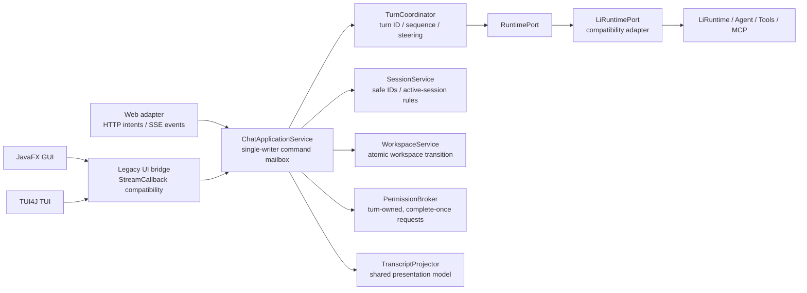

# Shared UI and Web Security Foundation Design

**Date:** 2026-07-12

**Status:** Approved for implementation planning

**Scope:** Shared frontend application state plus complete Web migration
**Compatibility:** Existing `config.yaml`, CLI arguments, slash-command names, session JSONL, and session metadata remain readable

## 1. Context

Li Code currently exposes three interactive frontends: TUI4J, JavaFX, and an embedded HTTP/SSE Web UI. All three call `LiRuntime` directly and independently implement turn state, cancellation, session switching, workspace switching, permissions, tool presentation, lifecycle handling, and transcript projection.

This duplication has produced divergent behavior and several correctness and security defects:

- Web requests share one mutable `LiRuntime`, `ConversationManager`, active session, `streamingThread`, and `lastAgent`. A second chat cancels the first, and an old disconnected SSE callback can subsequently cancel the newer turn.
- `SessionManager` resolves caller-provided session IDs directly beneath `.licode/sessions`, allowing path traversal from Web session endpoints.
- `/api/files` performs a lexical prefix check without a complete normalized/real-path boundary check.
- The local Web control plane has no capability, Host/Origin checks, CSRF protection, strict method rules, or security headers.
- The Web Markdown renderer creates HTML with string replacements and unsafe link attributes, allowing JavaScript URLs and attribute injection.
- GUI and TUI cancellation has no turn generation identifier; late callbacks can alter a later turn or session.
- GUI and TUI execute some resume/compact/shutdown work synchronously on their UI event threads.
- The three frontends disagree about `/clear`, `/compact`, plan mode, tool results, lifecycle hooks, workspace switching, and session history.

The test baseline on 2026-07-12 is 474 tests passing, 2 skipped, and no failures. There are no automated tests for `com.licode.web`, `com.licode.gui`, or `com.licode.tui`.

## 2. Product Decisions

The following decisions were explicitly approved:

1. Build the shared state and security foundation before redesigning all three frontends.
2. Treat Web mode as loopback-only, local, and single-user.
3. Allow multiple browser tabs as synchronized views of the same workspace, active session, and active turn.
4. Preserve existing configuration, CLI, session files, metadata, and slash-command names.
5. If a message is submitted while a turn is active, safely cancel and persist the active turn before starting the new message.
6. Permit a small number of mature dependencies with verified Java 21 compatibility and licenses.
7. Deliver the shared core and a complete Web migration first. GUI and TUI use a compatibility bridge until their later migration phases.
8. Use the compatibility-facade approach: place an application-state owner around the existing runtime rather than rewriting all of `LiRuntime` or introducing a local daemon in the first phase.

## 3. Goals

- Give turn, session, workspace, permission, and presentation state a single writer.
- Make cancellation a request-scoped, observable, normal terminal outcome.
- Ensure a new turn cannot start until the previous turn has terminated and its session boundary has been persisted.
- Reject stale events, permissions, Stop requests, and disconnected subscribers without affecting the active turn.
- Centralize session and workspace path validation below all UI adapters.
- Protect every Web API request with a per-process capability and request validation.
- Remove the string-replacement Markdown/XSS boundary.
- Separate Web commands from Web event subscription so browser connection lifetime does not own Agent lifetime.
- Split the Web monolith into testable server, application, transport, state, rendering, and style units.
- Preserve current user data and entry points.
- Establish a boundary that GUI and TUI can adopt without redesigning the core again.

## 4. Non-Goals

- A full JavaFX visual redesign is not part of this phase.
- A full TUI visual redesign or TUI library replacement is not part of this phase.
- LAN or Internet hosting, multi-user authentication, and per-user runtime isolation are not supported.
- The first phase does not introduce a separate daemon, WebSocket service, database, or frontend framework.
- Session JSONL is not migrated to a new mandatory format.
- The first phase does not promise pixel-identical rendering across Web, GUI, and TUI.
- Raw HTML embedded in Markdown is not preserved; it is escaped or removed by design.

## 5. Architecture

### 5.1 Component boundary



`ChatApplicationService` is the only component allowed to mutate application-visible turn, session, workspace, permission, and transcript state. It receives typed intents through a serial command mailbox and publishes immutable snapshots plus typed events.

`LiRuntime` remains the runtime kernel. UI code may not directly call its mutable conversation/session/workspace methods after migration. `LiRuntimePort` adapts the current kernel to a narrow, turn-scoped contract.

### 5.2 Core types

The shared package will define these conceptual types:

- `UiIntent`: `Ask`, `Stop`, `NewSession`, `SwitchSession`, `DeleteSession`, `ClearConversation`, `CompactConversation`, `ChangeWorkspace`, and `ResolvePermission`.
- `UiEvent`: `SnapshotPublished`, `TurnStarted`, text/thinking deltas, tool start/arguments/result, permission request/resolution, notice, connection state, and terminal turn events.
- `UiSnapshot`: immutable workspace, active session, projected transcript, turn state, tools by tool-call ID, pending permissions, connection/readiness state, plan mode, and usage.
- `TurnId`: opaque unique identifier generated for each accepted turn.
- `EventSequence`: monotonically increasing application sequence used for stale-event rejection and Web reconnection.
- `TurnHandle`: a turn ID, completion stage, and idempotent cancel operation.
- `RuntimePort`: starts one turn, requests cancellation for a specific turn, exposes completion, persists a valid boundary, and closes runtime-scoped resources.

The application state machine includes:

```text
Idle
Running(turnId)
AwaitingPermission(turnId, requestId)
Cancelling(turnId, optionalQueuedMessage)
Completed(turnId)
Cancelled(turnId)
Failed(turnId, error)
```

Only the current `turnId` and a strictly newer event sequence may update current state. A terminal state is emitted once.

### 5.3 Required invariants

1. `ChatApplicationService` is the single writer for application state.
2. At most one runtime turn can be active.
3. A turn has exactly one terminal outcome: completed, cancelled, or failed.
4. User cancellation is not reported as an error.
5. Events, permission decisions, and Stop requests for a stale turn cannot change current state.
6. `clear`, new/resume/delete session, compact, and workspace change are serialized state barriers.
7. A later turn cannot begin until the prior turn has a valid conversation boundary and has been persisted.
8. Browser subscriber lifetime is independent from runtime turn lifetime.
9. Tool presentation is keyed by `toolCallId`; parallel tools cannot share one mutable current-tool slot.
10. Permission requests are owned by a turn and complete exactly once. Every non-Allow terminal path resolves to Deny.

## 6. Safe Interrupt and Continue

When message M2 arrives while turn T1 is running:

1. The command mailbox records `SteeringRequested(T1, M2)` and moves T1 to `Cancelling`.
2. `PermissionBroker` completes every unresolved T1 permission request with Deny.
3. `RuntimePort.cancel(T1)` cancels the Agent/LLM work for T1 and prevents new tools from starting.
4. The event pump remains active. It drains T1 events and ignores any event that violates the turn/sequence rules.
5. Partial assistant text is committed at most once. Any emitted `tool_use` without a result receives a synthetic interrupted error result. Cancellation cannot leave an orphaned API conversation.
6. The Agent and event pump reach a confirmed terminal boundary.
7. New session messages are persisted incrementally. Persistence finishes before a public terminal event is published.
8. `TurnCancelled(T1)` is published.
9. M2 is appended to the conversation, receives a new T2 ID, and starts.

The current `LiRuntime.cancel()` sequence must change for the new port path. It currently interrupts the event consumer before the Agent has delivered a consumable cancellation boundary, causing the callback to receive `Stream interrupted`. The port must cancel Agent work, continue draining, validate/persist the boundary, then publish the terminal outcome.

The legacy `ask(String, StreamCallback)` entry point remains during migration and is implemented through a compatibility bridge. New Web code uses the typed application API only.

## 7. Sessions and Workspaces

### 7.1 Compatible safe session IDs

Current generated IDs use `yyyyMMdd-HHmmss-mmm`, where the millisecond suffix can be one to three digits. Existing valid files remain readable.

Central session ID/path validation must:

- reject blank IDs, control characters, absolute paths, `.`/`..`, and either platform path separator;
- limit ID length to a documented bounded size;
- resolve a normalized candidate whose parent is exactly the normalized session directory;
- for existing files, reject symbolic-link/junction traversal outside the real session root;
- apply identically to read, write, metadata, delete, resume, and title operations;
- live in or beneath `SessionManager`, not only in the HTTP layer.

Deleting the active session either transitions to a new empty session before deletion or returns a conflict. It cannot leave a live in-memory conversation whose backing files have been removed.

### 7.2 Workspace paths

Web clients send workspace-relative logical tokens, not arbitrary absolute paths. Directory listing resolves the real workspace root and the real requested path and rejects any candidate outside the root. Responses return relative tokens and display names, not absolute server paths.

Workspace change is atomic:

1. Safely finish the active turn.
2. Construct every workspace-scoped service for the candidate workspace: environment/prompt context, permission checker, instructions, memory, failures, sessions, skills, sub-agent specs/tools, teams/tasks, worktrees, and titles.
3. Publish the new workspace snapshot only after all required services are ready.
4. On failure, close partially created candidate services and continue using the old workspace unchanged.

The application no longer treats `System.user.dir` as the authoritative mutable workspace state.

## 8. Local Web Security Model

### 8.1 Trust model

Web mode remains bound to loopback and is local single-user. Loopback binding is necessary but not sufficient because browsers can issue cross-origin requests to local services and DNS rebinding can change address resolution.

At startup, Web mode generates a cryptographically random 256-bit process capability. The server injects it into a generated `<meta name="licode-capability">` element in the root HTML response. External application JavaScript reads and immediately removes that element. The capability is not stored in URL history, referrers, logs, cookies, local storage, or session storage.

Every `/api/*` request must pass a shared request gate:

- exact allowed loopback `Host` and bound port;
- allowed same-origin `Origin` when present;
- appropriate `Sec-Fetch-Site` when present;
- constant-time match of `X-LiCode-Capability`;
- exact route and HTTP method;
- exact accepted Content-Type for mutation requests;
- explicit body, concurrency, and rate limits.

There is no permissive CORS policy. Bare navigation to `http://localhost:<port>` remains supported.

### 8.2 Security headers

HTML and assets use `Cache-Control: no-store`, `X-Content-Type-Options: nosniff`, `Referrer-Policy: no-referrer`, and a restrictive Content Security Policy. Inline JavaScript and inline CSS are removed from the application page. The policy includes at least:

```text
default-src 'self';
script-src 'self';
style-src 'self';
object-src 'none';
base-uri 'none';
frame-ancestors 'none';
```

Image and font directives are extended only for assets the application actually packages.

### 8.3 Markdown and HTML

The approved rendering dependencies are:

- `org.commonmark:commonmark:0.29.0`, BSD-2-Clause, Java 11+;
- `com.googlecode.owasp-java-html-sanitizer:owasp-java-html-sanitizer:20260313.1`, Apache-2.0/BSD licensed.

During streaming, assistant output is rendered through DOM `textContent`. On completion or session restore, the server parses Markdown with CommonMark, escapes raw HTML, enables unsafe-URL filtering, and sanitizes the generated HTML with a narrow OWASP allowlist.

The allowlist supports the formatting Li Code actually needs: paragraphs, line breaks, emphasis, strong text, headings, lists, block quotes, code/preformatted text, tables, and links. Link protocols are limited to `http` and `https`. Event attributes, style, raw scripts, `javascript`, `data`, `vbscript`, `mailto`, and unknown protocols are removed. External links receive `target="_blank"` and `rel="noopener noreferrer nofollow"` after sanitization policy checks.

Only sanitized output is assigned to `innerHTML`.

### 8.4 Tool previews

Web transport code no longer reads model-supplied file paths. A shared tool-presentation service resolves paths against the active workspace, validates the operation, limits bytes and lines before reading, and applies a bounded diff algorithm. Preview creation occurs once per tool call. It is safe to show before write approval only after the path has passed the read/workspace safety policy.

### 8.5 Resource budgets

The first implementation uses explicit defensive limits:

- ask message body: 1 MiB UTF-8;
- every other JSON mutation body: 64 KiB UTF-8;
- concurrent SSE subscribers: 8;
- in-memory replay buffer: 2,048 application events;
- one directory response: 2,000 entries;
- one transcript page: 100 projected items;
- one preview input file: 1 MiB or 2,000 lines, whichever is reached first;
- one rendered tool-result preview: 200 KiB, with the full result retained only by the existing tool-result/session budget mechanisms;
- one diff preview: 2,000 source lines and 2,000 target lines, using a bounded-memory implementation.

Limit violations produce visible typed validation errors. They do not silently truncate commands, paths, permission decisions, or security-relevant identifiers. Display-only transcript/tool previews may be explicitly marked as truncated.

## 9. Web Protocol and State

Commands and subscriptions are separate:

```text
POST /api/commands/ask             -> 202 with turnId
POST /api/turns/{turnId}/stop      -> idempotent cancel intent
GET  /api/snapshot                 -> current immutable state
GET  /api/events?after=<sequence>  -> SSE event subscription
```

The new Web frontend uses these route names directly. The existing browser-internal `/api/chat` long-lived POST/SSE route is removed when the bundled frontend migrates; configuration, CLI, slash commands, and persisted sessions are unaffected. Closing a tab or losing an SSE connection only detaches a subscriber. It never calls process-global cancellation.

Every tab receives the shared snapshot and subsequent sequence-ordered events. Reconnection first obtains a current snapshot and then resumes after a known sequence. If an event gap cannot be replayed, the client discards transient local state and uses the snapshot.

The Web reducer models connection and turn state explicitly. Network, JSON, and SSE parse failures become visible states rather than empty catches.

## 10. Web User Experience

The first phase retains a dark coding-assistant visual direction while fixing structure and interaction:

- desktop uses a session sidebar plus the main transcript; narrow screens use an accessible sidebar drawer instead of hiding navigation;
- the header shows workspace, model/readiness, and explicit turn/connection state;
- the composer remains editable while a turn runs;
- a non-empty composer during a running turn exposes `Interrupt & send`; Stop remains a separate action;
- queued steering text visibly waits for the current turn's cancellation barrier;
- tools are independent cards keyed by tool-call ID and display parameter summary, result/error, and elapsed time;
- long tool output is collapsed and bounded;
- permission requests appear inline with Allow Once, Always Allow, and Deny; dismissal resolves to Deny;
- disconnect shows `Reconnecting`; reconnect restores state without duplicate messages;
- semantic buttons, labels, focus handling, keyboard controls, `aria-live`, and touch-accessible destructive actions are required;
- Markdown is plain text while streaming and safely enhanced after completion.

The existing single `index.html` is split into a small HTML shell, external CSS, API client, event decoder, pure reducer/store, renderers, and focused UI components. No large frontend framework is introduced.

## 11. Error Handling

Application errors are typed:

- validation errors do not mutate state and map to HTTP 400;
- authentication/request-gate failures map to 401/403 without internal detail;
- stale or conflicting state transitions map to 409 and include the current state version where useful;
- missing resources map to 404;
- runtime failures terminate the current turn once, preserve a valid partial transcript, and do not poison later turns;
- disconnection is a subscriber state, not a runtime failure;
- cancellation is a normal terminal outcome.

All close operations are idempotent. Application shutdown proceeds in this order:

1. Stop accepting new commands.
2. Cancel the active turn.
3. Deny unresolved permissions.
4. Drain the event pump and establish a valid conversation boundary.
5. Persist the active session.
6. Close subscribers and pollers.
7. Stop team/sub-agent work and close MCP/worktree resources.
8. Flush memory within its bounded shutdown policy.
9. Close executors.

## 12. Testing Strategy

All feature and bug-fix work follows red-green-refactor.

### 12.1 Path tests

- current generated session IDs read/write/delete normally;
- traversal, absolute paths, mixed separators, encoded separators, control characters, long IDs, symlinks, and junctions are rejected;
- file browsing rejects `..` and real-path escapes while allowing normal Unicode workspace children;
- active-session deletion preserves memory/disk consistency.

### 12.2 Coordinator/reducer tests

- one terminal outcome per turn;
- T2 cannot start before T1 cancellation and persistence finish;
- stale deltas, errors, permissions, and Stop requests cannot change T2;
- partial text and orphan tool calls are repaired on cancellation;
- parallel tools remain mapped by ID;
- subscriber disconnect cannot cancel a turn;
- permission requests complete exactly once on every terminal path.

### 12.3 HTTP integration tests

- route/method/Content-Type/body-limit enforcement;
- capability, Host, Origin, request-site, and response-header enforcement;
- unauthorized callers cannot ask, Stop, change session/workspace, browse files, or resolve permissions;
- concurrent tabs, old socket disconnect, stale Stop, reconnect, slow subscriber, Unicode SSE, and sequence recovery;
- workspace transition rollback and current-session deletion;
- permission replay and stale-turn rejection.

### 12.4 Markdown/security tests

- script tags, event attributes, quote injection, unsafe/mixed-case/encoded protocols, and raw HTML are removed;
- supported Markdown remains functional;
- streaming uses text nodes;
- only sanitizer output reaches HTML insertion;
- the application starts under the strict CSP without `unsafe-inline`.

### 12.5 Interaction and compatibility tests

- full running/cancelling/cancelled/new-turn state flow;
- reconnect without duplicate transcript items;
- tool and permission keyboard flows;
- accessible navigation at 320, 375, 768, and desktop widths;
- bounded behavior for long answers, tool arguments/results, history, directories, and diffs;
- old configuration, CLI, JSONL, and metadata remain readable;
- the shaded JAR contains all split Web assets and sanitizer/parser dependencies;
- Web startup smoke and full Maven test/package verification pass.

## 13. Delivery Slices

### Slice 1: Safe paths

Centralize session and workspace path handling, active-session deletion behavior, and regression tests. This removes the highest-impact filesystem issues independently of the Web migration.

### Slice 2: Shared turn state

Introduce intents, events, immutable snapshot, runtime port, turn handle, coordinator, and application service. Complete cancellation, steering, stale-event, and permission tests against a fake runtime.

### Slice 3: Runtime compatibility adapter

Implement the turn-scoped `LiRuntimePort`, correct cancel/drain/persist ordering, and keep the legacy `StreamCallback` entry point operating through a bridge.

### Slice 4: Web server and protocol

Split routing/security/serialization/event streaming, add the process capability and request gate, and move session/workspace/tool-preview operations behind application services.

### Slice 5: Web frontend

Split static assets, implement the reducer/store and approved layout, add steering, tools, permissions, reconnect, responsive navigation, accessibility, and safe Markdown enhancement.

### Slice 6: Lifecycle, packaging, and documentation

Unify shutdown and workspace transitions, run the full test/package/smoke matrix, and update architecture and Web usage/security documentation.

## 14. Follow-On Phases

1. Migrate JavaFX to the shared application service, prioritizing FX-thread blocking, permission completion, tool IDs/results, workspace/sidebar consistency, and lifecycle closure before visual polish.
2. Migrate TUI to the shared application service while retaining TUI4J 0.3.3. Replace hand-written editor/menu/spinner behavior with its existing widgets and move all blocking work out of `update()`.
3. Run measured Windows/Linux PTY, Unicode, input, resize, and performance spikes. Consider direct JLine or an external Go/Rust TUI only if those measurements demonstrate a concrete TUI4J limitation.
4. Unify visual language, shortcuts, tool presentation, and advanced interaction across all three frontends.

## 15. Acceptance Criteria

The first phase is accepted when:

- all approved compatibility inputs remain usable;
- path traversal and workspace escape tests pass;
- unauthorized/cross-origin Web control attempts fail;
- Markdown injection tests pass under strict CSP;
- safe interrupt-and-continue is deterministic under concurrent and stale-callback tests;
- closing/reloading a browser tab cannot cancel an active Agent;
- multi-tab state converges through snapshot and event sequence;
- session/workspace destructive transitions cannot race an active turn;
- the approved Web interaction states and accessibility requirements are implemented;
- lifecycle resources close in the specified order;
- `mvn test` and `mvn clean package` pass with the complete change set;
- GUI and TUI remain functional through the compatibility bridge pending their dedicated migrations.
